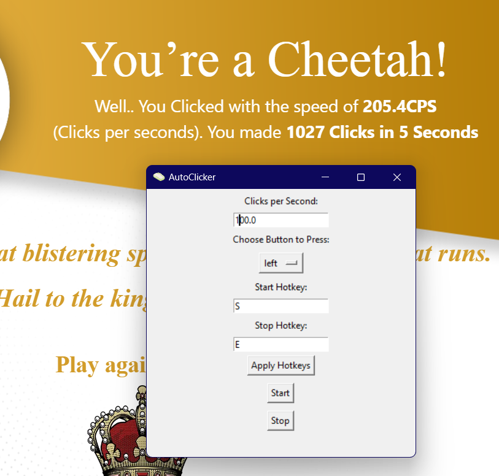

# AutoClicker
# Author: Malek Mansour
# Version: 3.0.1


An autoclicker application with customizable click speed, hotkeys, and button choice. The autoclicker runs on Windows and allows users to set hotkeys to start/stop the clicking process, with a quick emergency quit option. Written in Python using Tkinter for the GUI.

## Features

- Customizable clicks per second
- Choice of left or right mouse button clicks
- Start and stop hotkeys, with the ability to customize keybinds
- Status overlay showing whether the autoclicker is active

  
*Main application window with options for customizing settings*

## Installation

1. **Clone the repository**:
   ```bash
   git clone https://github.com/MalekMansour/Autoclicker
   cd Autoclicker/main
   ```

2. **Run the application**:
   ```bash
   python autoclicker.py
   ```

## Usage

1. **Configure Settings**:
   - Set the clicks per second.
   - Choose between left or right mouse clicks.
   - Customize the start and stop hotkeys by entering your preferred keys and clicking "Apply Hotkeys."

2. **Starting and Stopping**:
   - Use the Start hotkey or the "Start" button to begin clicking.
   - Use the Stop hotkey or the "Stop" button to end clicking.

## Contributing

1. **Fork the repository**.
2. Create a new branch:
   ```bash
   git checkout -b my-feature
   ```
3. Make your changes and commit:
   ```bash
   git commit -m "Add my feature"
   ```
4. Push to the branch:
   ```bash
   git push origin my-feature
   ```
5. Open a pull request.

---